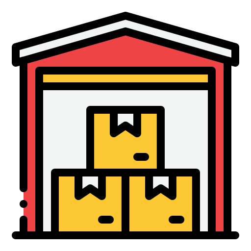

<a name="readme-top" id="readme-top"></a>

<!-- PROJECT LOGO -->
<br />
<div align="center">
  <a href="#">
    
  </a>

  <h3 align="center">Stock Management</h3>

  <p align="center">
    Website pengelola stok masuk dan keluar terbaik.
    <br />
    <a href="http://8.215.5.250:9001/
    "><strong>Explore the Website »</strong></a>
    <br />
    <br />
  </p>
</div>

## Tentang Stock Management

[![Product Name Screen Shot][product-screenshot]](http://8.215.5.250:9001/)

Website pengelola stok barang merupakan platform yang dirancang untuk mempermudah pengelolaan dan monitoring stok barang secara efisien. Dengan fitur-fitur canggih dan user interface yang intuitif, website ini cocok untuk berbagai jenis bisnis mulai dari retail kecil hingga perusahaan besar yang membutuhkan kontrol yang ketat terhadap persediaan barang mereka.

<p align="right">(<a href="#readme-top">back to top</a>)</p>

### Tech Stack

Projek ini menggunakan teknologi sebagai berikut:

- ![Laravel.com][Laravel.com]
- ![Mysql][Mysql]

<p align="right">(<a href="#readme-top">back to top</a>)</p>

<!-- GETTING STARTED -->

## Fitur

1. Manajemen Stok Terpadu:

   - Memungkinkan pengguna untuk mencatat masuk dan keluarnya barang secara detail.
   - Mengelola kategori barang untuk pengelompokan yang lebih baik.

2. Pemantauan Stok Real-Time:

   - Menampilkan informasi stok barang secara langsung dan akurat.
   - Grafik dan laporan visual untuk memudahkan analisis performa stok.

3. Manajemen Supplier:
   - Database supplier untuk memantau dan mengelola hubungan dengan pemasok.
   - Informasi kontak dan riwayat transaksi dengan setiap supplier.

### Cara Penggunaan

_Ikuti petunjuk dibawah untuk penggunaan program._

1. Clone repository
   ```sh
   git clone https://github.com/Sistem-Stock-Barang-Yunta/Sistem-Stock-Barang-Yunta.git
   ```
2. Masuk ke direktori
   ```sh
   cd "Sistem-Stock-Barang-Yunta"
   ```
3. Install Dependency
   ```sh
   composer install
   ```
4. Buat file .env dan sesuaikan config database
   ```sh
   DB_CONNECTION=mysql
   DB_HOST=127.0.0.1
   DB_PORT=3306
   DB_DATABASE=sistem-stok-barang
   DB_USERNAME=root
   DB_PASSWORD=
   ```
5. Hubungkan dengan storage public
   ```sh
   php artisan storage:link
   ```
6. buat database bernama "sistem-stok-barang" sesuai data di .env
   ```sh
   CREATE DATABASE sistem-stok-barang;
   ```
7. Migrasi database
   ```sh
   php artisan migrate
   ```
8. Gunakan data seeder
   ```sh
   php artisan db:seed
   ```
9. Jalankan program
   ```sh
   php artisan serve
   ```

<p align="right">(<a href="#readme-top">back to top</a>)</p>

<!-- ACKNOWLEDGMENTS -->

<!-- ## Acknowledgments

Use this space to list resources you find helpful and would like to give credit to. I've included a few of my favorites to kick things off!

- [Choose an Open Source License](https://choosealicense.com)
- [GitHub Emoji Cheat Sheet](https://www.webpagefx.com/tools/emoji-cheat-sheet)
- [Malven's Flexbox Cheatsheet](https://flexbox.malven.co/)
- [Malven's Grid Cheatsheet](https://grid.malven.co/)
- [Img Shields](https://shields.io)
- [GitHub Pages](https://pages.github.com)
- [Font Awesome](https://fontawesome.com)
- [React Icons](https://react-icons.github.io/react-icons/search)

<p align="right">(<a href="#readme-top">back to top</a>)</p> -->

<!-- MARKDOWN LINKS & IMAGES -->
<!-- https://www.markdownguide.org/basic-syntax/#reference-style-links -->

[instagram-shield]: https://img.shields.io/badge/Instagram-E4405F?style=for-the-badge&logo=instagram&logoColor=white
[instagram-url]: https://www.instagram.com/accenggg
[portfolio-shield]: https://img.shields.io/badge/Portfolio-255E63?style=for-the-badge&logo=About.me&logoColor=white
[portfolio-url]: https://michaelarselius.com/
[stars-shield]: https://img.shields.io/github/stars/othneildrew/Best-README-Template.svg?style=for-the-badge
[stars-url]: https://github.com/othneildrew/Best-README-Template/stargazers
[issues-shield]: https://img.shields.io/github/issues/othneildrew/Best-README-Template.svg?style=for-the-badge
[issues-url]: https://github.com/othneildrew/Best-README-Template/issues
[license-shield]: https://img.shields.io/github/license/othneildrew/Best-README-Template.svg?style=for-the-badge
[license-url]: https://github.com/othneildrew/Best-README-Template/blob/master/LICENSE.txt
[linkedin-shield]: https://img.shields.io/badge/-LinkedIn-black.svg?style=for-the-badge&logo=linkedin&colorB=555
[linkedin-url]: https://www.linkedin.com/in/michael-arselius-pamasi-240aa1278/
[product-screenshot]: public/assets/img/ss.png
[Next-url]: https://nextjs.org/
[React.js]: https://img.shields.io/badge/React-20232A?style=for-the-badge&logo=react&logoColor=61DAFB
[React-url]: https://reactjs.org/
[Html]: https://img.shields.io/badge/HTML5-E34F26?style=for-the-badge&logo=html5&logoColor=white
[Css]: https://img.shields.io/badge/CSS3-1572B6?style=for-the-badge&logo=css3&logoColor=white
[Javascript]: https://img.shields.io/badge/JavaScript-323330?style=for-the-badge&logo=javascript&logoColor=F7DF1E
[Vue.js]: https://img.shields.io/badge/Vue.js-35495E?style=for-the-badge&logo=vuedotjs&logoColor=4FC08D
[Vue-url]: https://vuejs.org/
[Angular.io]: https://img.shields.io/badge/Angular-DD0031?style=for-the-badge&logo=angular&logoColor=white
[Angular-url]: https://angular.io/
[Svelte.dev]: https://img.shields.io/badge/Svelte-4A4A55?style=for-the-badge&logo=svelte&logoColor=FF3E00
[Svelte-url]: https://svelte.dev/
[Laravel.com]: https://img.shields.io/badge/Laravel-FF2D20?style=for-the-badge&logo=laravel&logoColor=white
[Laravel-url]: https://laravel.com
[Bootstrap.com]: https://img.shields.io/badge/Bootstrap-563D7C?style=for-the-badge&logo=bootstrap&logoColor=white
[Bootstrap-url]: https://getbootstrap.com
[JQuery.com]: https://img.shields.io/badge/jQuery-0769AD?style=for-the-badge&logo=jquery&logoColor=white
[JQuery-url]: https://jquery.com
[Mysql]: https://img.shields.io/badge/MySQL-005C84?style=for-the-badge&logo=mysql&logoColor=white
